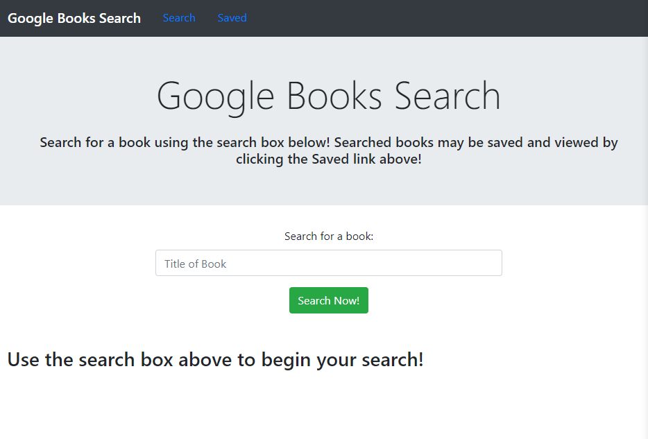
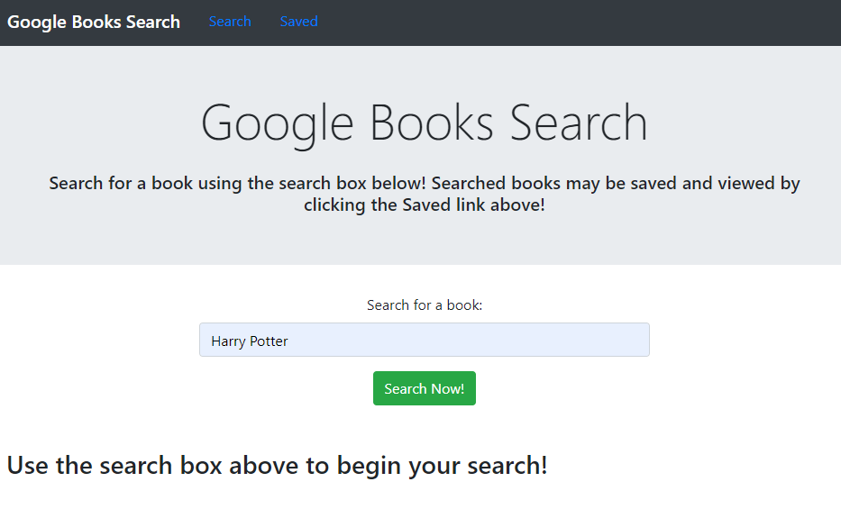
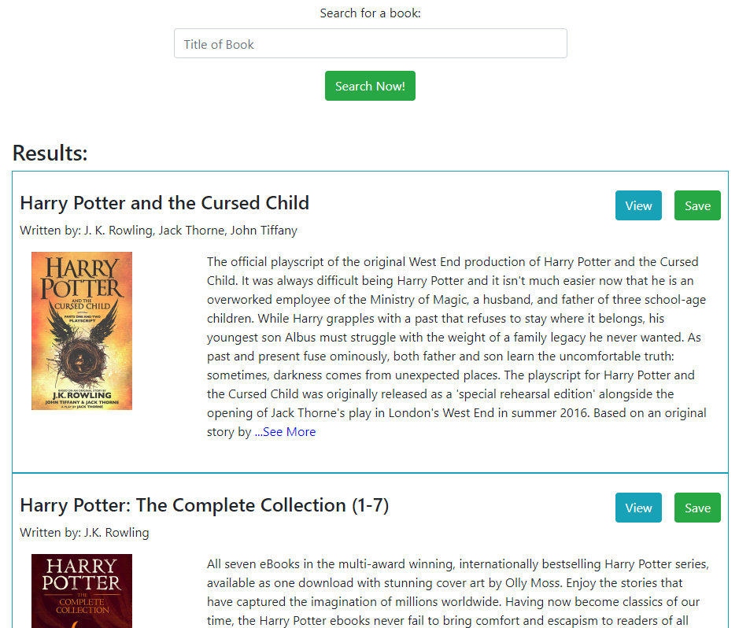
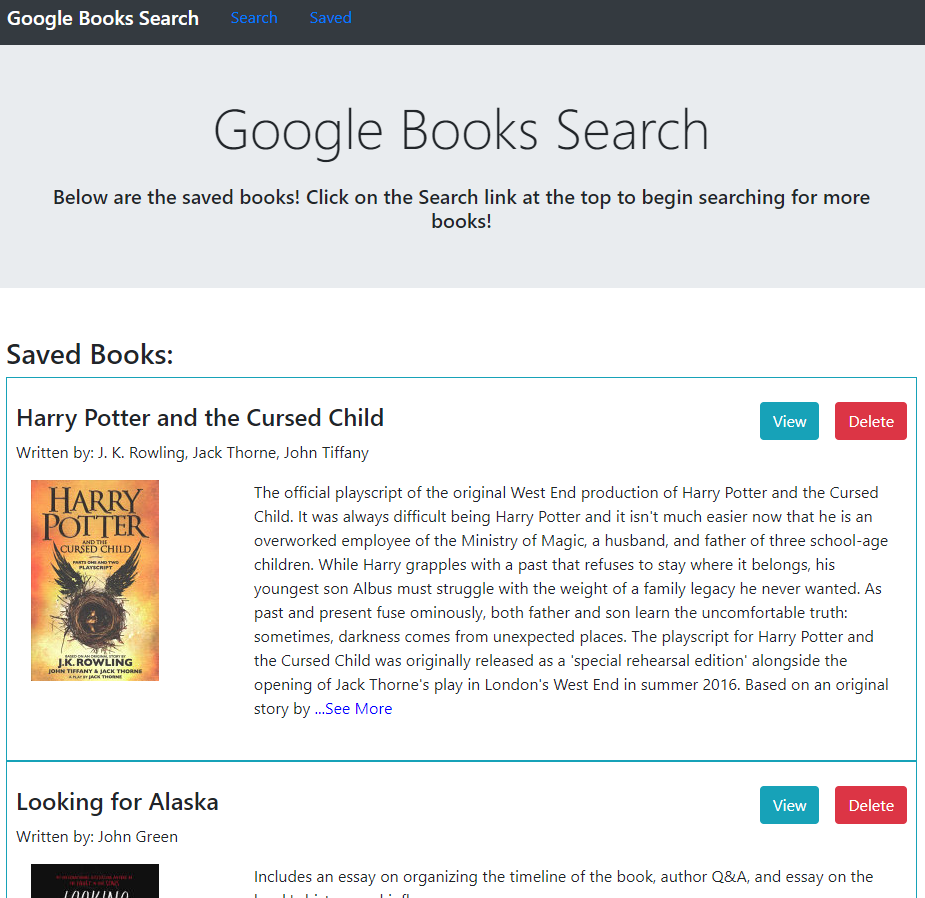

# Google-Books-Search

***
<p align="center">
  
  
  
  

</p>

[](https://opensource.org/licenses/MIT)



## Table of Contents
* [Description](#description)
* [Installation](#installation)
* [Usage](#usage)
* [Questions](#questions)
* [License](#license)

<br>

## Description
This is a full-stack app in which a user may search for a book using the Google Books API.  Users may save books that they search for, or view the book in Google Books.  Users may also delete books from the saved list.  When a user saves a book, other users will be notified.

Feel free to check out the website [here](https://christina2021-books-search.herokuapp.com/#/).
<br>

## Installation
If you are cloning this repo, please see the following command needed in order to use this application:<br>
```bash
npm i
npm start
```
This application will require Node.js and MongoDB.  Please make sure these are installed for the app to function properly.


## Usage
Please see the following instructions on how to use this application: <br>
⭐ Once the webpage has been opened, the user will see a search box in which they may enter in a book they would like search for.  Clicking the "Search Now" button after entering in a book title will pull up the results.<br><br>
<br>
⭐ The results will list out books that were pulled from the Google Books API.  Each result will show the title, author, book cover image, book description (with a "...See More" link if the description is long), and a view and save button.  The view button will open the book in Google Books (in a new tab).  The save button will add the book to the Saved list.<br><br>
<br><br>
⭐ The Saved section will show a list of books saved by users.  A user may view a book in Google Books in a new tab, or they may delete a book from the list.  <br><br>
<br><br>
⭐ If other users are using the app when one user saves a book, they will be sent a notification (through the use of the socket.io and bootstrap-notify packages). The below screenshot will show 2 different windows opened for the app where one clicked the save button, and the other received the notification.  <br><br>
<br>

## Questions?
Feel free to check out my github profile [here](https://github.com/Christina2021)!
Should you have any questions, you may reach me by e-mail at: <a href="mailto:codechristina2021@gmail.com">codechristina2021@gmail.com</a>!

## License
[MIT](https://choosealicense.com/licenses/mit/#)